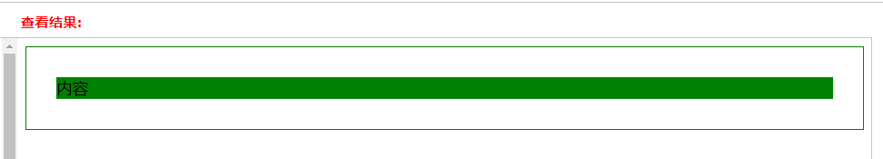
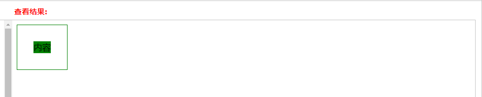

当块级元素设置浮动，且该块级元素没有设置宽高时。
那么浮动之后，块级元素的宽高由其子元素的宽高决定。
表现出的行为，类似包裹。

```
<style>
.container{
    border: 1px solid green;
    
    padding: 30px;
    background-color: green;
    background-clip: content-box;/*将背景裁剪到内容框，方便看浮动元素效果*/
}
.fl{
    float: left;
}
</style>

<div class="container">
内容
</div>
```
  

```
<div class="container fl">
内容
</div>
```
